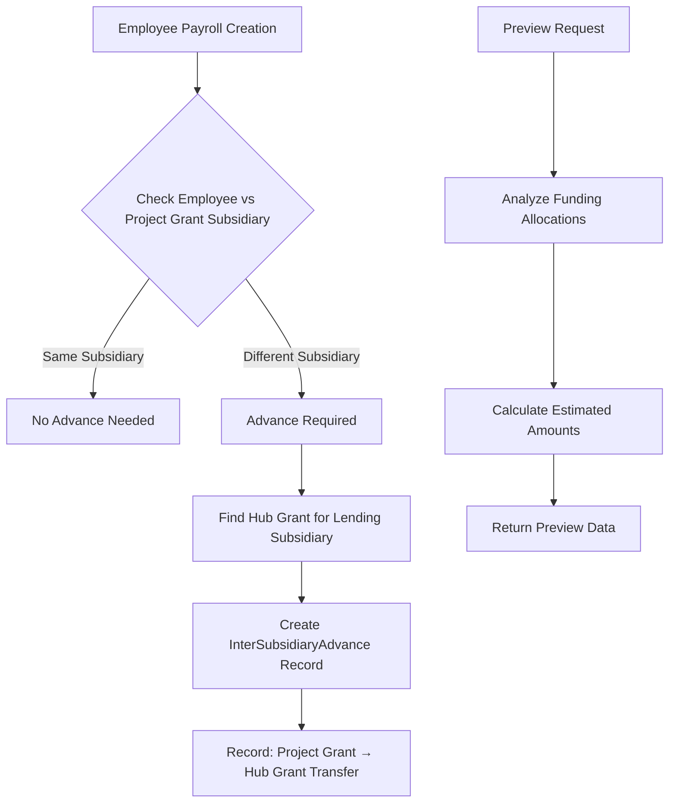

# InterSubsidiaryAdvance Implementation Guide

## 🎯 **IMPLEMENTATION SUMMARY**

We have successfully implemented a **Backend-Only Approach** for InterSubsidiaryAdvance detection and management with enhanced payroll preview functionality.

## 🔧 **COMPLETED FIXES & ENHANCEMENTS**

### **1. Model-Migration Mismatch Fix**
- ✅ **Fixed**: `InterSubsidiaryAdvance` model now uses `payroll_id` (matching migration)
- ✅ **Added**: `payroll()` relationship to `InterSubsidiaryAdvance` model
- ✅ **Updated**: Swagger documentation to reflect correct field names

### **2. Hub Grant Helper Methods**
- ✅ **Added**: `Grant::getHubGrantForSubsidiary(string $subsidiary)` - Gets correct hub grant
- ✅ **Added**: `Grant::isHubGrant()` - Checks if grant is a hub grant
- ✅ **Added**: `Grant::getHubGrantCodes()` - Returns hub grant mapping
- ✅ **Added**: `Grant::getAllHubGrants()` - Gets all hub grants

### **3. Enhanced PayrollService**
- ✅ **Updated**: `createInterSubsidiaryAdvanceIfNeeded()` to use correct hub grant logic
- ✅ **Added**: `previewInterSubsidiaryAdvances()` method for advance preview
- ✅ **Enhanced**: Logging and error handling for advance creation

### **4. PayrollController Enhancement**
- ✅ **Added**: `previewAdvances()` endpoint (`GET /api/v1/payrolls/preview-advances`)
- ✅ **Added**: Complete Swagger documentation for the new endpoint
- ✅ **Added**: Route registration with proper permissions

## 🏗️ **HOW IT WORKS**

### **Business Logic Flow:**



### **Example Scenarios:**

#### **Scenario 1: SMRU Employee on BHF Grant**
```json
{
  "employee": {
    "staff_id": "0002",
    "name": "Tiana Blanda", 
    "subsidiary": "SMRU"
  },
  "funding_allocation": {
    "project_grant": {
      "code": "BHF001",
      "name": "BHF Research Grant",
      "subsidiary": "BHF"
    }
  },
  "advance_created": {
    "from_subsidiary": "BHF",
    "to_subsidiary": "SMRU", 
    "via_grant": {
      "code": "S22001",
      "name": "General Fund (BHF Hub Grant)"
    },
    "amount": 25000,
    "notes": "Hub grant advance: BHF001 → S22001 for 0002"
  }
}
```

#### **Scenario 2: BHF Employee on SMRU Grant**
```json
{
  "advance_created": {
    "from_subsidiary": "SMRU",
    "to_subsidiary": "BHF",
    "via_grant": {
      "code": "S0031", 
      "name": "Other Fund (SMRU Hub Grant)"
    }
  }
}
```

## 🔌 **API ENDPOINTS**

### **1. Preview Advances (NEW)**
```http
GET /api/v1/payrolls/preview-advances
```

**Parameters:**
- `employee_id` (required): Employee ID
- `pay_period_date` (required): Pay period date (YYYY-MM-DD)

**Response:**
```json
{
  "success": true,
  "message": "Advance preview retrieved successfully",
  "data": {
    "advances_needed": true,
    "employee": {
      "id": 2,
      "staff_id": "0002",
      "name": "Tiana Blanda",
      "subsidiary": "SMRU"
    },
    "pay_period_date": "2025-01-31",
    "advance_previews": [
      {
        "allocation_id": 1,
        "allocation_type": "grant",
        "level_of_effort": 0.8,
        "project_grant": {
          "id": 2,
          "code": "BHF001", 
          "name": "BHF Research Grant",
          "subsidiary": "BHF"
        },
        "hub_grant": {
          "id": 3,
          "code": "S22001",
          "name": "General Fund",
          "subsidiary": "BHF"
        },
        "from_subsidiary": "BHF",
        "to_subsidiary": "SMRU",
        "estimated_amount": 20000,
        "formatted_amount": "฿20,000.00"
      }
    ],
    "summary": {
      "total_advances": 1,
      "total_amount": 20000,
      "formatted_total_amount": "฿20,000.00"
    }
  }
}
```

### **2. Automated Advance Creation**
- **When**: Automatically during payroll creation (`PayrollController::store()`)
- **How**: `PayrollService::processPayroll()` calls `createInterSubsidiaryAdvanceIfNeeded()`
- **Result**: InterSubsidiaryAdvance records created automatically

## 🖥️ **UI INTEGRATION RECOMMENDATIONS**

### **Frontend Implementation:**

#### **1. Enhanced Payroll Creation Screen:**
```javascript
// Call preview API when employee is selected
const previewAdvances = async (employeeId, payPeriodDate) => {
  const response = await fetch(`/api/v1/payrolls/preview-advances?employee_id=${employeeId}&pay_period_date=${payPeriodDate}`);
  const data = await response.json();
  
  if (data.data.advances_needed) {
    showAdvancePreview(data.data);
  }
};

const showAdvancePreview = (advanceData) => {
  // Display advance preview in UI
  const previewHtml = `
    <div class="advance-preview alert alert-info">
      <h5>🏦 Inter-Subsidiary Advance Required</h5>
      <p>This employee's funding requires ${advanceData.summary.total_advances} advance(s):</p>
      <ul>
        ${advanceData.advance_previews.map(advance => `
          <li>
            <strong>Project:</strong> ${advance.project_grant.code} (${advance.project_grant.subsidiary}) →
            <strong>Hub:</strong> ${advance.hub_grant.code} (${advance.hub_grant.subsidiary})<br>
            <strong>Amount:</strong> ${advance.formatted_amount}
          </li>
        `).join('')}
      </ul>
      <p><strong>Total:</strong> ${advanceData.summary.formatted_total_amount}</p>
      <small class="text-muted">💡 Advances will be automatically created when payroll is processed</small>
    </div>
  `;
  document.getElementById('advance-preview-container').innerHTML = previewHtml;
};
```

#### **2. InterSubsidiaryAdvance Management Dashboard:**
```javascript
// Fetch and display advances
const loadAdvances = async (filters = {}) => {
  const response = await fetch('/api/v1/inter-subsidiary-advances?' + new URLSearchParams(filters));
  const data = await response.json();
  renderAdvancesTable(data.data);
};

// Settlement functionality  
const settleAdvance = async (advanceId, settlementData) => {
  const response = await fetch(`/api/v1/inter-subsidiary-advances/${advanceId}`, {
    method: 'PUT',
    headers: { 'Content-Type': 'application/json' },
    body: JSON.stringify({
      settlement_date: settlementData.date,
      notes: settlementData.notes
    })
  });
  
  if (response.ok) {
    showSuccessMessage('Advance settled successfully');
    loadAdvances(); // Refresh table
  }
};
```

## 🎯 **KEY BENEFITS**

### **✅ Automated Detection**
- System automatically detects when advances are needed
- No manual intervention required for advance creation
- Consistent business rule enforcement

### **✅ Proper Hub Grant Logic** 
- Uses correct hub grants for inter-subsidiary transfers
- BHF lends via "General Fund" (S22001)
- SMRU lends via "Other Fund" (S0031)

### **✅ Comprehensive Preview**
- Shows advance requirements before payroll creation
- Displays estimated amounts and grant details
- Helps users understand financial implications

### **✅ Audit Trail**
- All advances automatically linked to payroll records
- Clear notes explaining the advance purpose
- Proper logging for troubleshooting

## 🚀 **TESTING**

### **Test the Preview Endpoint:**
```bash
curl -X GET "http://localhost:8000/api/v1/payrolls/preview-advances?employee_id=2&pay_period_date=2025-01-31" \
  -H "Authorization: Bearer YOUR_TOKEN" \
  -H "Accept: application/json"
```

### **Test Payroll Creation with Auto-Advance:**
```bash
curl -X POST "http://localhost:8000/api/v1/payrolls" \
  -H "Authorization: Bearer YOUR_TOKEN" \
  -H "Content-Type: application/json" \
  -d '{
    "employment_id": 1,
    "employee_funding_allocation_id": 1,
    "pay_period_date": "2025-01-31",
    "basic_salary": 25000
  }'
```

## 📋 **NEXT STEPS**

1. **Test the Implementation**: Use the API endpoints to verify functionality
2. **Frontend Integration**: Implement the advance preview in your payroll UI  
3. **Advance Management UI**: Create the dashboard for managing advances
4. **Settlement Workflow**: Implement settlement tracking and reporting
5. **Performance Monitoring**: Monitor advance creation and settlement patterns

The system is now ready to automatically handle inter-subsidiary advances with proper hub grant logic and comprehensive preview functionality! 🎉
